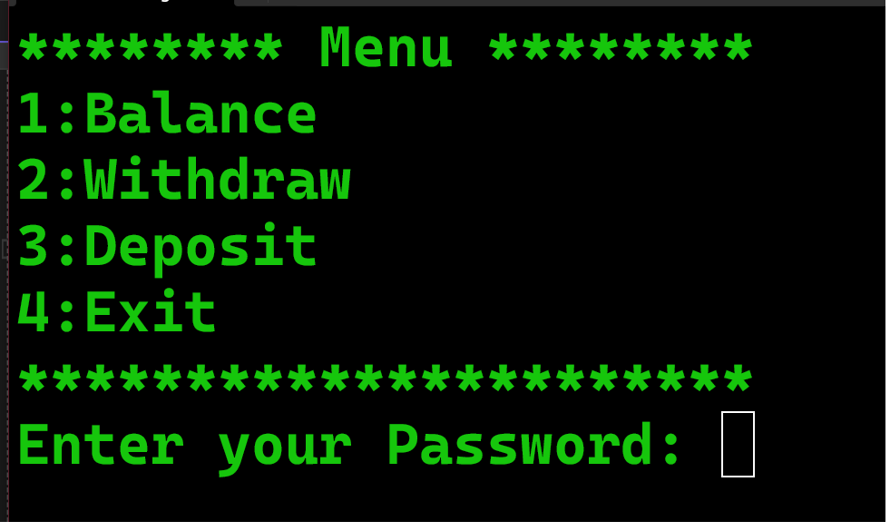

# 🏧 Simple ATM Simulation (v1_basic_procedural)



A straightforward command-line ATM (Automated Teller Machine) program written in C++ using a procedural approach.

## 📜 Description

This project is a basic simulation of an ATM's core functionalities. It provides a simple, menu-driven interface for users to manage a mock bank account. The primary goal is to demonstrate fundamental programming concepts like variables, conditional statements (`if-else`, `switch`), loops (`do-while`), and functions in C++.

## ✨ Features

* **Check Balance:** View the current account balance.
* **Withdraw Funds:** Withdraw a specified amount from the account. The system checks to ensure the user does not withdraw more than the available balance.
* **Deposit Funds:** Add a specified amount to the account.
* **Basic Security:** A hardcoded password (`9988`) is required to access the menu.
* **Interactive Menu:** A simple and clear menu to navigate through the options.

## 🚀 How to Run

To compile and run this program, you will need a C++ compiler (like G++).

1.  **Save the Code:**
    Save the code in a file named `main.cpp`.

2.  **Open the Terminal:**
    Navigate to the directory where you saved the file.

3.  **Compile the Program:**
    Run the following command to compile the code:
    ```bash
    g++ main.cpp -o atm
    ```

4.  **Execute the Program:**
    * On Windows:
        ```bash
        atm.exe
        ```
    * On macOS/Linux:
        ```bash
        ./atm
        ```

5.  **Interact with the ATM:**
    * The program will ask for a password. The default password is `9988`.
    * Follow the on-screen menu to perform transactions.

## 💻 Language

* **C++**