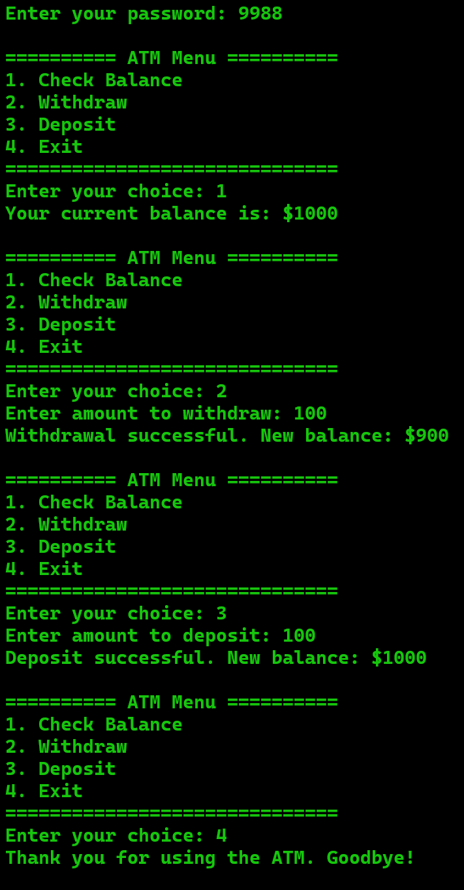

# 🏧 Simple ATM Simulation (v2_optimized_procedural)



This is the second, optimized version of a command-line ATM program. This version refactors the original code into a more organized and modular structure using a procedural approach, where each core functionality is handled by a dedicated function.

## 🌟 What's New in V2? (Key Improvements)

This version introduces significant improvements over the original:

* **Modular Design:** The code is now broken down into smaller, single-purpose functions (`login`, `showBalance`, `withdraw`, `deposit`, etc.). This makes the code much cleaner, more readable, and easier to maintain.
* **Use of Constants:** The password is now a `const` variable, which is a best practice for values that should not change during program execution.
* **Improved Input Validation:** The system now includes checks for invalid inputs, such as attempting to withdraw or deposit a zero or negative amount.
* **Clearer Logic:** The main program flow is managed by a cleaner loop and straightforward function calls, removing the complex nested logic of the previous version.

## ✨ Core Features

* **Check Balance:** View the current account balance.
* **Withdraw Funds:** Withdraw a specified amount from the account.
* **Deposit Funds:** Add a specified amount to the account.
* **Basic Security:** A hardcoded password (`9988`) is required to access the menu.
* **Interactive Menu:** A simple and clear menu to navigate through the options.

## 🚀 How to Run

To compile and run this program, you will need a C++ compiler (like G++).

1.  **Save the Code:**
    Save the code in a file named `main.cpp`.

2.  **Open the Terminal:**
    Navigate to the directory where you saved the file.

3.  **Compile the Program:**
    Run the following command to compile the code:
    ```bash
    g++ main.cpp -o atm
    ```

4.  **Execute the Program:**
    * On Windows:
        ```bash
        atm.exe
        ```
    * On macOS/Linux:
        ```bash
        ./atm
        ```

5.  **Interact with the ATM:**
    * The program will ask for a password. The default password is `9988`.
    * Follow the on-screen menu to perform transactions.

## 💻 Language

* **C++**